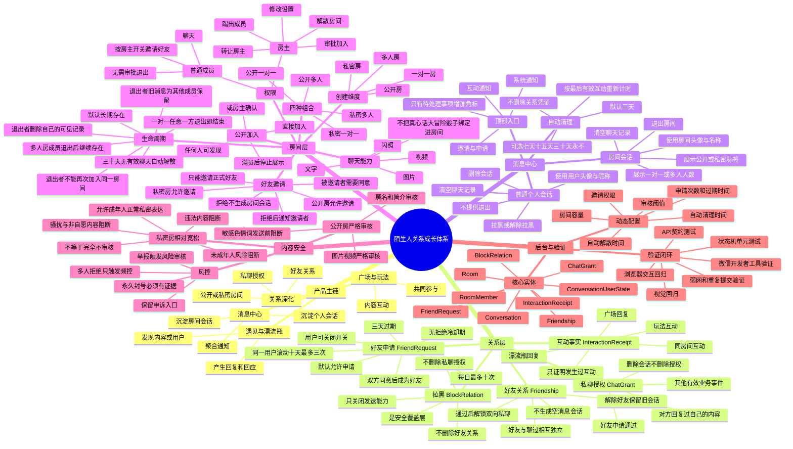
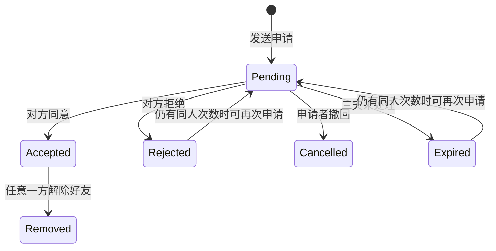

# 关系、消息与房间体系逻辑基线

- 版本：1.0
- 日期：2026-07-16
- 状态：已确认，可用于交互设计与后续实现
- 适用范围：微信小程序用户端、后台运营配置、审核与数据模型
- 配套产品约束：`PRODUCT.md`

> 本文档是关系、消息、好友和房间业务的逻辑基线。后续原型或代码与本文冲突时，应先修改并重新确认本文，而不是在页面中临时增加例外。

## 可复制思维导图

下面是标准 Mermaid `mindmap` 语法，可以直接复制到支持 Mermaid 的 Markdown、文档或绘图工具中。



## 核心术语

| 术语 | 准确定义 | 不代表什么 |
|---|---|---|
| 互动过 | 双方之间发生过可证明的业务互动 | 不等于好友，不一定已经私聊 |
| 私聊授权 | 当前业务允许双方建立或继续普通个人会话 | 不等于好友，不等于存在会话记录 |
| 好友 | 一方申请、另一方同意后建立的双向关系 | 不等于必须加入同一个房间 |
| 普通个人会话 | 以两个用户为主体的一对一消息线程 | 不是房间，没有退出功能 |
| 一对一房间 | 通过创建房间流程产生、容量固定为两人的房间 | 不是普通个人会话 |
| 多人房间 | 容量大于两人，拥有房主和成员状态的房间 | 不自动让成员互为好友 |
| 公开房 | 可以在广场被发现的房间 | 不等于任何人必然直接加入 |
| 私密房 | 不公开发现、主要通过好友邀请进入的房间 | 不等于免于平台安全审核 |

## 不可破坏的业务原则

1. `互动事实`、`私聊授权`、`好友关系`、`会话实体`、`房间成员关系`和`拉黑状态`必须分开保存。
2. 一个用户可以同时满足“互动过、拥有私聊授权、已经是好友、同处一个房间”。它们不是单线等级。
3. 删除、清空或自动清理消息，不能误删好友、私聊授权或互动凭证。
4. 同处一个房间不会自动成为好友，也不会自动获得普通个人私聊权限。
5. 普通个人会话没有“退出”；一对一房间属于房间，因此拥有“退出房间”。
6. 活跃房间不提供“删除会话”，否则新房间消息会立即让记录重新出现。
7. 退出房间后，退出者不能重新进入同一个房间；退出者的历史消息继续为其他成员保留。
8. 拉黑不自动解除好友，不自动删除会话，也不自动退出共同房间，只关闭双方直接发送能力。
9. 多人拒绝好友申请不能直接导致封号；永久处罚必须有风险证据和申诉状态。
10. 玩法是独立业务，可以从聊天发起邀请，但不成为房间消息模型的一部分。
11. 消息列表只负责查看和管理会话，不放含义模糊的全局“＋”；私密房从个人聊天输入栏“＋”发起，公开房从广场房间入口创建。

## 好友申请状态机



规则：

- 用户设置“允许别人申请好友”默认开启。
- 关闭开关只阻止新申请；已有待处理申请仍可处理，已有好友不受影响。
- 每个发送者每天最多成功创建10条好友申请。
- 同一发送者对同一接收者，滚动10天内最多成功创建3条申请。
- 同一对用户同一时间只能存在一条 `Pending` 申请。
- 拒绝后不设置额外冷却；是否可以再次申请只由每日额度和同人额度决定。
- 双方互相发送申请时，后一次操作视为同意现有申请，避免出现两条相反记录。
- 好友通过后建立双向私聊授权，但在有人真正发送消息前，不创建空会话列表项。
- 好友拒绝不发送带有对方姓名的强刺激推送；申请记录显示“未通过”。

## 私聊权限规则

`ChatGrant` 必须记录授权来源，至少支持：

- `content_reply`：对方回复过自己的漂流瓶、广场或其他内容。
- `friend_accept`：好友申请通过。
- `business_event`：后续经过确认的其他业务事件。

私聊按钮规则：

| 条件 | 按钮 | 点击结果 |
|---|---|---|
| 没有任何授权 | 灰色“去私聊” | 提示“对方回复过你的内容后，才可以私聊” |
| 对方回复过自己的内容 | 可用“去私聊” | 创建或打开普通个人会话 |
| 好友申请通过 | 可用“发消息” | 创建或打开普通个人会话 |
| 被对方拉黑 | 保留入口但禁止发送 | 提示“你已经被对方拉黑，无法发送消息” |
| 对方账号受限 | 禁止发送 | 显示系统限制说明 |

解除好友时只移除 `friend_accept` 来源。如果仍有 `content_reply` 等来源，继续允许聊天；如果没有其他来源，保留旧会话但禁用发送。

## 普通个人会话操作

消息列表中的普通用户会话左滑提供：`清空聊天记录`、`删除会话`、`拉黑/解除拉黑`。

已确认的交互规范：

- 会话行使用14px圆角分组；左滑操作层位于行内，不占用消息列表常态空间。
- 操作层使用接近白色的 `#fbfbfd`，外层衬底使用 `#f2f2f7`；不使用深色或高饱和色块。
- `清空`使用深系统蓝，`删除/退出`使用系统红，`拉黑`使用石墨灰；图标与文字共同表达语义。
- 清空成功时必须同时清零当前用户的未读数，避免残留角标。
- 确认弹窗采用“确认具体动作？+ 一句不可逆后果”，不展示数据库或其他成员的数据规则。

| 操作 | 自己的记录 | 自己的列表 | 对方 | 私聊授权 | 是否通知对方 |
|---|---|---|---|---|---|
| 清空聊天记录 | 删除 | 保留 | 不变 | 保留 | 否 |
| 删除会话 | 删除 | 移除 | 不变 | 保留 | 否 |
| 拉黑 | 保留 | 保留 | 无法直接发送 | 保留 | 发送时明确提示 |
| 解除拉黑 | 保留 | 保留 | 恢复原授权状态 | 保留 | 否 |

### 会话状态一致性

列表、聊天页和后台必须使用同一份会话状态，禁止各自在 DOM 或页面局部变量中单独维护角标、记录和拉黑状态。

- `unread_count` 由 `latest_message_seq - last_read_seq` 或等价的服务端读游标计算，不以“页面上是否还有红点元素”作为数据事实。
- 打开个人会话或房间会话时，前端先乐观更新 `last_read_seq` 并立即移除当前行角标，再向后台提交已读游标；提交失败时重新拉取服务端未读数。
- 清空聊天记录写入用户侧 `history_cleared_before_seq`，并把本地可见消息和未读数同时清零；重新进入后不得重新显示清空前的消息。
- 删除会话在清空用户侧历史的基础上，将当前用户的会话入口设为不可见；对方后续发送新消息时，使用新消息序号重新创建入口，旧消息仍不可恢复。
- 拉黑状态独立保存为关系限制，不能通过改一行预览文字代替。拉黑后记录与会话入口保留，文字、语音、媒体、玩法邀请和房间邀请都必须在发送前检查权限。
- 解除拉黑只恢复原有权限和最后一条有效消息预览，不恢复已清空或已删除的历史。
- 会话行角标、预览、拉黑标签、聊天正文和输入栏权限必须由同一个 `conversation_state` 渲染，任何操作成功后统一刷新这些消费者。

补充规则：

- 删除会话后，如果对方仍有发送权限并发送新消息，会话重新出现在列表中。
- 重新出现的会话只展示删除后产生的新消息，旧记录不可恢复。
- 清空或删除是用户级状态，不允许全局删除对方的数据。
- 自动清理逻辑等价于“按用户删除历史和会话入口”，不影响关系凭证。

## 普通个人会话自动清理

- 全局默认：3天无有效互动自动清理。
- 可选：7天、15天、30天、永不。
- 根据最后一条有效用户消息重新计时，系统提示和已撤回消息不延长时间。
- 可以在用户设置中修改全局默认，也可以在单个会话中覆盖。
- 用户可见旧记录永久不可恢复；后台只保留满足安全审核所需的最小证据。

## 房间创建模型

房间入口先按使用场景分流，再选择人数模式：

```text
私密房：个人聊天 → 输入栏“＋” → 房间 → 选择一对一 / 多人
       → 输入房间名称 → 创建房间 → 创建者立即进入房间会话
       → 当前聊天对象作为建议邀请对象 → 在房间内发出邀请
       → 对方同意后，对方才产生房间会话并成为成员

公开房：广场 → 房间发现 → 创建房间 → 选择一对一 / 多人
       → 输入房间名称 → 设置直接加入 / 房主确认、容量和成员邀请权限
       → 创建公开房间会话 → 可继续邀请好友
```

消息列表右上角不提供创建入口，避免“发起聊天、建群、建公开房”三种含义混在同一个“＋”中。

创建与邀请必须拆开：创建房间只建立 `Room`、创建者的 `RoomMember(owner)` 和创建者侧会话；邀请是进入房间后的独立动作。被邀请者拒绝或邀请过期，不删除创建者的房间。创建者可以继续邀请其他符合条件的好友，或主动解散空房间。

个人聊天输入区固定规则：

- 默认只显示 `麦克风 → 输入框 → 发送 → 加号`，所有媒体与玩法入口隐藏。
- 点击加号后，输入栏整体向上移动，底部展开两行功能；关闭后输入栏回到底部。
- 第一行是图片、闪照、视频、摇骰子；第二行是真心话、大冒险、房间和更多玩法。
- 摇骰子直接产生一条聊天结果；真心话和大冒险发送独立玩法邀请，不成为房间消息类型。
- 点击房间才打开居中的圆角创建弹窗；不使用常驻面板或底部创建抽屉。
- 创建成功后，创建者侧房间立即出现在最近会话，即使尚未邀请或无人接受。

四种组合：

| 房间类型 | 发现方式 | 默认加入方式 | 容量 |
|---|---|---|---|
| 公开一对一 | 广场可见，也可邀请好友 | 直接加入或房主确认 | 固定2人 |
| 公开多人 | 广场可见，也可邀请好友 | 直接加入或房主确认 | 默认20人，后台可配 |
| 私密一对一 | 不公开，只能邀请好友 | 被邀请者同意 | 固定2人 |
| 私密多人 | 不公开，只能邀请好友 | 被邀请者同意 | 默认20人，后台可配 |

房主创建时可以控制 `allow_member_invite`：

- 公开房默认开启，普通成员可邀请自己的好友。
- 私密房默认关闭，仅房主可邀请；房主可以主动开启。
- 开启后代表房主预先授权成员邀请，被邀请者同意即可进入，不进行第二次房主审批。
- 邀请对象必须是正式好友；仅“聊过但不是好友”的用户不能直接出现在邀请列表。

## 房间邀请与公开加入

### 房间邀请

- 房间邀请默认3天过期。
- 同一个房间对同一用户只能存在一条待处理邀请。
- 用户接受后加入房间并产生房间会话。
- 用户拒绝后不产生会话，邀请者收到：“小雨拒绝加入「深夜故事」房间”。
- 其他成员不收到拒绝通知。
- 房间已满、已解散、用户已加入、双方好友关系解除时，未处理邀请自动失效。

### 公开加入

公开房创建时由房主选择：

- `direct`：点击后直接加入。
- `owner_approval`：点击后产生加入申请，房主同意后加入。

加入申请默认3天过期。房间满员后停止在广场展示，并禁止继续批准申请。

## 房间角色与权限

| 能力 | 房主 | 普通成员 |
|---|---:|---:|
| 发送房间消息 | 是 | 是 |
| 邀请好友 | 是 | 由 `allow_member_invite` 决定 |
| 审批公开加入 | 是 | 否 |
| 修改房名与设置 | 是 | 否 |
| 踢出成员 | 是 | 否 |
| 转让房主 | 是 | 否 |
| 解散房间 | 是 | 否 |
| 主动退出 | 转让或解散后 | 是，不需要审批 |

房主退出规则：

- 多人房：退出前选择转让房主或解散房间，不需要其他成员审批。
- 一对一房：任意一方退出都会结束房间，不进行房主转让。
- 房主账号被封禁或注销：多人房优先转让给仍正常且最早加入的活跃成员；无可转让成员时解散。一对一房直接结束。

## 房间退出、踢出与解散

| 操作 | 操作者 | 对操作者/目标用户 | 对其他成员 | 是否可重新加入 |
|---|---|---|---|---|
| 主动退出 | 普通成员 | 删除自己的可见记录并撤销媒体访问 | 历史消息保留，显示其已退出 | 否 |
| 一对一退出 | 任意成员 | 删除退出者可见记录 | 另一方保留只读历史，房间结束 | 否 |
| 踢出成员 | 房主 | 目标用户删除可见记录并撤销访问 | 历史消息保留，显示其被移出 | 默认否，房主解除限制后可再次邀请 |
| 解散房间 | 房主或系统 | 全体失去访问入口 | 房间结束 | 否，需创建新房间 |

退出确认文案必须明确：

> 退出后将删除你的房间聊天记录，并且无法再次进入该房间。

数据规则：

- 退出者自己无法再查看房间历史、图片、视频和闪照。
- 退出者以前发送的消息继续保留给其他成员，发送人标注“已退出成员”。
- 退出不是撤回消息，不能用退出销毁其他成员的上下文或举报证据。
- 公开房也遵守“主动退出后不能重新进入同一房间”。

## 房间生命周期

- 房间默认长期存在。
- 连续30天没有有效用户聊天时，系统自动解散。
- 系统消息、加入提示、改名提示不延长生命周期。
- 自动解散时间来自后台配置。
- 解散前应提供可配置提醒，设计默认在剩余3天时通知房主和仍在房间的成员。
- 已解散房间允许用户删除自己的历史入口，但不能恢复或重新启用原房间。

## 房间消息能力

房间聊天本期只支持：

- 文字
- 图片
- 闪照
- 视频
- 回复、复制、删除自己的本地记录、举报

玩法边界：

- 真心话、大冒险、骰子属于独立玩法系统。
- 可以从普通私聊或其他入口发起玩法邀请，但玩法状态和结果不写进房间成员状态。
- 房间页面不展示“公开房、私密房、临时房”三个玩法式快捷按钮。

设计默认的消息细节：

- 自己发送的消息在后台配置的时间窗口内允许撤回，初始建议2分钟。
- 闪照只能查看一次；已查看、已过期、退出房间后都显示失效占位，不再次返回媒体地址。
- 举报必须绑定原始消息ID和审核证据，用户侧删除不能删除审核证据。

## 内容安全与处罚

### 公开房

- 文本在发送前进行严格审核，明显色情敏感词直接阻断。
- 房间名称、简介、头像、图片和视频使用公开内容审核标准。
- 违规内容不允许先公开展示后再等待长时间审核。

### 私密房

- 对成年人之间正常的私密或暧昧表达采用更宽松策略。
- 违法内容、未成年人风险、诈骗、威胁骚扰、非自愿私密内容仍然阻断并进入风险处理。
- 私密代表不对外公开，不代表平台无法审核。

### 风控状态

```text
正常
→ 限制好友申请
→ 限制发送消息
→ 临时冻结
→ 永久封禁
```

- 多人拒绝只影响申请频率，不直接封号。
- 原始举报数量只触发检查，不能单独成为永久封号证据。
- 永久封禁必须有关联内容、行为证据或人工审核结果。
- 所有处罚保留申诉状态和后台审计记录。

## 消息中心信息架构

消息页是“查看、处理和继续已有关系”的入口，不承担创建公开房。个人聊天输入栏“＋”提供图片、闪照、视频和私密房；公开房创建只出现在广场房间发现页。

- 进入消息标签时默认显示消息首页，不自动跳进最近一次个人聊天或房间。
- 点击个人会话进入个人聊天；点击房间会话进入对应房间聊天，不能只让新建房间可进入。
- 新建且尚无其他成员的房间显示邀请空状态，输入栏锁定；已有成员的房间直接显示历史消息和可用输入栏。
- 房间输入栏只提供文字、图片、闪照和视频，不复用个人聊天里的骰子、真心话和大冒险面板。
- 解散房间必须按当前 `room_id` 移除对应会话，禁止使用“最近创建房间”之类的前端临时引用代替真实房间标识。

```text
消息
├─ 互动通知
│  ├─ 漂流瓶回应
│  ├─ 广场回复
│  ├─ 点赞与礼物
│  └─ 点击用户头像查看资料
├─ 邀请与申请
│  ├─ 好友申请
│  ├─ 房间邀请
│  └─ 公开房加入申请
├─ 系统通知
│  ├─ 风险与处罚
│  ├─ 会员和配额
│  └─ 账号与后台通知
└─ 最近会话
   ├─ 普通个人会话
   ├─ 公开一对一房
   ├─ 公开多人房
   ├─ 私密一对一房
   └─ 私密多人房
```

角标规则：

- 顶部入口只统计未读或待用户处理的数量。
- 已同意、已拒绝、已过期的结果不持续占用红点。
- 接受房间邀请后，邀请从待处理列表消失，房间进入最近会话。
- 好友申请通过后不自动生成空会话，只有第一条真实消息生成会话列表项。
- 互动通知、邀请与申请、系统通知三个入口均必须可点击，并进入各自的二级列表。
- 房间邀请在二级列表中提供接受/拒绝；好友申请提供同意/拒绝；处理后同步清理待处理角标。
- 房间中的更多菜单必须提供邀请好友、房间设置和解散房间；解散需要二次确认，并从所有成员的有效会话中移除。

## 前后台核心实体

| 实体 | 责任 |
|---|---|
| `InteractionReceipt` | 保存最小互动事实和来源，不保存已清理的完整内容副本 |
| `ChatGrant` | 保存私聊授权来源、双方和有效状态 |
| `FriendRequest` | 保存申请者、接收者、过期时间和处理状态 |
| `Friendship` | 保存正式好友关系及解除时间 |
| `Conversation` | 保存普通个人会话或房间会话的统一列表标识 |
| `ConversationUserState` | 保存每个用户的未读、免打扰、清空、删除和覆盖清理时间 |
| `Room` | 保存公开性、人数模式、加入策略、房主、容量和生命周期 |
| `RoomMember` | 保存邀请、申请、加入、退出、被踢和历史显示身份 |
| `BlockRelation` | 保存方向性拉黑状态，不覆盖好友与私聊授权 |
| `ModerationCase` | 保存举报、机器审核、人工审核、处罚和申诉证据链 |

任何接口都应支持幂等键，避免弱网或重复点击创建多条好友申请、房间邀请、加入申请或重复房间。

## 后台动态配置默认值

| 配置 | 默认值 |
|---|---:|
| 好友申请过期 | 3天 |
| 每日好友申请上限 | 10次 |
| 同一用户滚动窗口 | 10天内3次 |
| 是否允许好友申请 | 开启 |
| 普通个人会话自动清理 | 3天 |
| 可选自动清理 | 7、15、30天、永不 |
| 房间邀请过期 | 3天 |
| 公开加入申请过期 | 3天 |
| 多人房默认容量 | 20人 |
| 房间自动解散 | 30天无有效聊天 |
| 解散提醒 | 剩余3天 |
| 公开房成员邀请 | 默认允许 |
| 私密房成员邀请 | 默认仅房主，可开启 |

## 异常和边界状态

- 重复点击同意好友或房间邀请：接口幂等，只返回同一结果。
- 处理申请时房间已满：申请变为失效，向用户解释原因，不加入房间。
- 处理邀请时双方已解除好友：邀请失效。
- 房主审批时申请者已退出账号或被限制：不能加入。
- 用户多设备在线：清空、删除、拉黑、退出和未读状态按账号同步。
- 用户修改昵称或头像：历史消息通过稳定用户ID关联；显示策略由前端读取当前资料或历史快照。
- 用户删除会话后收到新消息：只恢复删除后的消息。
- 用户退出房间后通过旧链接访问：后端根据 `RoomMember.left` 拒绝，不能仅依赖前端隐藏。
- 房间30天计时期间出现系统提示：不重置计时。
- 房间被解散时仍有上传任务：取消发送并撤销临时媒体凭证。

## 设计和实现顺序

1. 消息中心与混合会话列表。
2. 通知、好友申请、房间邀请和加入申请二级页面。
3. 普通个人会话及左滑、更多菜单和私聊权限状态。
4. 创建房间分步流程。
5. 房间聊天、成员列表、房主设置和退出流程。
6. 用户资料卡与好友申请。
7. 广场公开房发现入口。
8. 将上述入口统一融入“遇见 → 消息 → 房间”的主链。
9. 后台配置、审核、状态查询和审计页面。
10. 微信开发者工具、浏览器、API和视觉回归验证。

## 验收底线

- 页面不能把普通私聊和一对一房间当成同一数据类型。
- 页面不能出现与当前实体不匹配的操作，例如普通私聊“退出”或活跃房间“删除会话”。
- 所有危险操作都需要准确说明影响范围，不能只写“确定吗”。
- 所有待处理状态都有加载、成功、失败、过期和重复点击结果。
- 所有后台动态值由接口返回，前端文案不得写死次数或时间。
- 所有改动完成后必须验证消息、好友、房间、拉黑、删除和自动清理没有互相回归。
