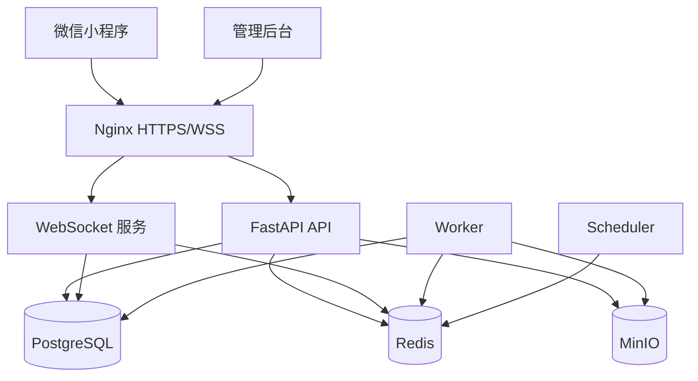

# 漂流瓶项目｜全量设计冻结、正式开发与上线交接规范

- 日期：2026-07-21
- 交接对象：新的 Codex 会话
- 项目范围：微信小程序用户端、FastAPI 后端、管理后台、Docker 上线配置
- 实施方案：方案 A——全量设计冻结后分层实现
- Git 分支：`test`、`main`

> 本文是后续工作的总执行约束。新 Codex 必须先阅读本文以及文末列出的事实源，再开展任何设计或实现。当前工作区已有大量未提交修改、删除文件和新增资产，全部视为用户资产。禁止执行 `reset`、`checkout`、`clean`、批量回退、批量删除或覆盖式重建。

## 一、最终目标

交付一套可真实运行、可在微信开发者工具实时预览、可部署到普通 Linux 服务器的完整产品，而非继续停留在 HTML 原型图。

完整交付包括：

1. 微信小程序用户端。
2. FastAPI 真实业务后端。
3. 人性化、美观、便捷、可查看、整体化、监控化、可搜索、可过滤的管理后台。
4. PostgreSQL、Redis、Worker、Scheduler、MinIO、Nginx 等完整 Docker 服务。
5. WebSocket 实时聊天与 HTTP 补偿同步。
6. 微信登录、微信支付、微信订阅消息的真实接入结构。
7. 分级内容审核、人工审核、客服证据查看及外部审核接口预留。
8. 测试分支和正式分支在同一台 Linux 服务器上的隔离部署。
9. 自动备份、可选远程备份、升级、恢复和回滚能力。
10. 设计、接口、功能、视觉、微信开发者工具和上线验收文档。

## 二、必须先阅读的事实源

按以下顺序完整阅读：

1. `docs/superpowers/specs/2026-07-20-detail-session-handoff.md`
2. `RELATIONSHIP_MESSAGE_ROOM_LOGIC.md`
3. `PRODUCT.md`
4. `DESIGN.md`
5. `.superpowers/brainstorm/267-1784168255/content/chat-message-room-v2.html`
6. `docs/superpowers/specs/2026-07-20-classic-play-modal-design.md`
7. `package.json`
8. `project.config.json`
9. `src/pages.json` 以及 `src/pages/`、`src/components/`、`src/services/`
10. `backend/`、`admin-web/`、`scripts/` 和现有测试目录

事实源优先级：

```text
本交接文档中的已确认决策
→ RELATIONSHIP_MESSAGE_ROOM_LOGIC.md 的业务状态机
→ PRODUCT.md 的产品定位
→ DESIGN.md 的视觉系统
→ 已批准的专项设计文档
→ 当前原型表达
→ 当前代码实现
```

若发生冲突，先记录冲突并修订设计事实源，禁止在页面局部代码中偷偷制造例外。

## 三、总体执行顺序与阶段门禁

```mermaid
flowchart LR
  A[保护工作区并完成资产盘点] --> B[整理全量产品逻辑]
  B --> C[完成用户端和后台全量设计]
  C --> D[设计评审与冻结]
  D --> E[数据模型和 API 契约冻结]
  E --> F[后端分层实现]
  F --> G[微信小程序真实制作]
  G --> H[管理后台真实制作]
  H --> I[支付/订阅/审核/存储联调]
  I --> J[Docker 与上线验收]
  J --> K[全量功能回归]
  K --> L[局部细节优化]
```



### 阶段 0：保护与盘点

- 保存 `git status --short --untracked-files=all` 快照。
- 记录已有修改、删除、新增文件和已有验证资产。
- 识别现有代码中可直接复用的页面、服务、模型和测试。
- 不主动整理无关文件，不修改已确认区域。

通过门槛：资产清单、现状架构图、已实现/半实现/缺失矩阵齐全。

### 阶段 1：优雅整理全量逻辑

先整理完整业务，不先画零散页面。至少覆盖：

- 微信登录、手机号按需绑定、登录态与账号注销。
- 遇见、漂流瓶、广场、玩法和附近的发现链路。
- 互动事实、私聊授权、好友申请、好友关系和拉黑关系。
- 消息中心、个人会话、漂流瓶私密回复线和房间会话。
- 公开/私密、一对一/多人房间的创建、邀请、加入、退出和解散。
- 文字、图片、闪照、视频、语音、骰子、真心话和大冒险。
- 会员、虚拟商品、订单、支付、退款和财务流水。
- 举报、内容审核、处罚、申诉、客服工单和审计。
- 系统配置、微信配置、存储、备份与运行状态。

每个模块必须输出：角色、入口、主流程、状态机、权限、异常状态、后台治理入口、接口需求和验收条件。

通过门槛：不存在相互冲突的状态定义；关键实体均有生命周期；所有失败和空状态均有处理方式。

### 阶段 2：完成全部设计

先完成设计，再制作正式页面。设计范围包含：

- 用户端全部一级、二级及必要三级页面。
- 所有弹层、抽屉、键盘顶起、上传、加载、空状态、失败和权限状态。
- 管理后台导航、仪表盘、列表、详情、搜索、过滤、图表、配置和审计页面。
- 桌面后台常用分辨率和小程序常见手机尺寸。
- 页面清单、用户流程图、信息架构、组件规范、交互说明和状态矩阵。

设计必须沿用“潮汐白页”：清透、圆润、克制、有层次。情绪内容可以使用海景与自然动态，任务页面回归稳定白色产品壳。

通过门槛：所有功能都有设计落点；所有设计都有对应业务状态；设计评审完成后标记冻结版本。

### 阶段 3：契约与架构冻结

在批量开发前冻结：

- 数据库实体和迁移策略。
- REST API、WebSocket 事件和错误码。
- 用户端、后台与后端共享的枚举和状态含义。
- 权限矩阵、内容审核场景和审计事件。
- 媒体上传、访问、过期和证据保留规则。
- 支付订单、回调、退款和幂等规则。

通过门槛：接口契约测试可执行；前后端不依赖临时 DOM 状态或写死规则。

### 阶段 4：真实制作与持续预览

正式用户端基于现有 `uni-app + Vue 3 + TypeScript + Pinia` 工程实现：

```powershell
npm run dev:mp-weixin
```

将生成目录导入微信开发者工具，整个实现期持续保持可编译、可启动、可点击和可实时预览。HTML 原型仅作为已批准设计参考，不作为正式交付。

每完成一个模块必须同步完成：真实接口、状态管理、异常处理、契约测试、微信工具验证和相邻功能回归。

### 阶段 5：完整验收后再优化细节

功能完整之前只修复阻断使用的问题，不开展全局审美重做。进入细节优化前必须满足：

- 用户端页面和状态覆盖完成。
- 后端接口、数据库迁移和 WebSocket 完成。
- 管理后台治理入口完成。
- 支付、订阅消息、审核、存储和备份链路完成。
- 测试分支 Docker 部署成功。
- 微信开发者工具和至少一轮真机验证通过。

## 四、局部细节优化隔离协议

每次细节任务必须创建一张“变更卡”：

```markdown
## 变更卡
- 目标区域：页面 / 组件 / 状态
- 当前问题：可复现描述
- 复现证据：截图、录屏或测试步骤
- 允许修改：明确文件、选择器、组件或逻辑
- 冻结区域：本次不得发生变化的页面与交互
- 预期结果：可观察、可量化
- 相邻回归：至少列出 3 项
- 微信工具验证：编译、操作路径、结果
- 回滚点：修改前文件与状态记录
```

强制流程：

```text
先复现 → 建立基线 → 只改目标 → 静态检查 → 自动测试
→ 微信开发者工具验证 → 回归相邻交互 → 对比变更范围 → 记录结果
```

门槛：

- 禁止顺手重构无关区域。
- 禁止修改共享组件后只检查当前页面。
- 禁止用全局 CSS 修复单页细节。
- 禁止以视觉改动掩盖状态或接口缺失。
- 差异超出变更卡允许范围时，立即停止并缩小修改。
- 每项细节优化独立验收，通过后才进入下一项。

## 五、微信小程序用户端要求

### 技术与预览

- 使用现有 uni-app 工程，不另建平行小程序。
- 微信开发者工具作为持续验证工具，而非最终阶段才导入。
- 保持 `project.config.json` 可用。
- 微信登录凭证只交给后端换取平台会话。
- 正式域名使用 HTTPS；WebSocket 使用 WSS。
- 真实手机输入法由系统提供，正式实现不模拟自制键盘。

### 账号体系

- 首次微信登录建立平台账号。
- 正常使用不强制绑定手机号。
- 支付退款、账号找回和高风险操作再引导绑定。
- 微信身份、平台用户 ID、手机号分离保存。
- 覆盖登录失效、账号限制、手机号更换、注销中和注销完成状态。

### 消息与房间

- 使用 `WebSocket + HTTP 补偿同步`。
- WebSocket 负责实时消息与状态事件。
- HTTP 负责历史分页、断线补拉、游标同步和媒体上传凭证。
- 每条消息使用唯一 `client_message_id` 和会话内递增序号。
- 支持发送中、已送达、失败、重发、已撤回和已读状态。
- 断线后按最后确认序号补拉；必要时降级为 HTTP 定时同步。
- 多设备同步已读、清空、删除、拉黑和房间成员状态。
- 后端在发送前重新校验拉黑、禁言、退出和审核权限。

房间和关系逻辑严格遵循 `RELATIONSHIP_MESSAGE_ROOM_LOGIC.md`。尤其保持：

- 互动、私聊授权、好友、会话、房间成员和拉黑相互独立。
- 普通个人会话没有退出操作。
- 活跃房间不提供删除会话，提供清空与退出。
- 退出者不可再次加入同一房间，历史消息继续为其他成员保留。
- 漂流瓶多人回复按回复者形成双方私密回复线，不自动转普通私聊。

## 六、管理后台要求

管理后台是正式产品，不是简单 CRUD 表格集合。

### 设计目标

- 人性化：按工作任务组织，待办优先，失败和权限状态清楚。
- 美观化：统一设计系统、稳定桌面工作台、克制而清晰。
- 便捷化：批量操作、保存筛选、列配置、快捷时间范围和上下文保留。
- 可查看化：核心实体均有完整详情与关联跳转。
- 整体化：用户、关系、内容、会话、房间、举报、订单与审计贯通。
- 监控化：业务指标、服务健康、异常事件和任务积压可查看。
- 搜索化：支持用户、内容、消息、会话、房间、举报、订单和审计统一搜索。
- 过滤化：服务端组合过滤、排序和分页，筛选状态同步到 URL。

### 三类后台角色

| 角色 | 核心权限 |
|---|---|
| 超级管理员 | 全局管理、风险处罚、配置、权限、财务审批、审计和服务状态 |
| 客服人员 | 用户与业务查询、工单、举报原始证据查看、处理建议和申请提交 |
| 财务人员 | 订单、退款、流水、对账、报表和财务异常处理 |

权限要求：

- 后端真实 RBAC 校验，不以隐藏菜单代替权限。
- 菜单、按钮、字段和数据范围分别授权。
- 客服可在具体举报或工单中查看关联原始聊天、图片、视频、语音和必要上下文。
- 客服证据访问、下载和扩大上下文必须记录审计。
- 财务不访问聊天内容和举报证据。
- 高风险处罚、退款和人工账务调整提交超级管理员审批。
- 超级管理员同样无权删除审计记录。

### 后台核心菜单建议

```text
总览
用户与关系
  用户管理
  好友与私聊授权
  拉黑与账号状态
内容与互动
  漂流瓶
  广场内容
  评论与回复
消息与房间
  会话查询
  消息证据
  房间管理
审核与客服
  举报中心
  人工审核
  客服工单
  处罚与申诉
财务
  商品与权益
  订单
  退款
  资金流水
  对账与报表
系统监控
  业务指标
  服务状态
  异常事件
  任务与日志
系统设置
  微信小程序
  微信支付配置
  微信订阅消息
  内容审核规则
  外部审核服务
  对象存储
  备份与恢复
  管理员与权限
  操作审计
```

## 七、内容审核分级

采用“内置规则审核 + 人工审核后台 + 外部审核服务接口预留”。规则需符合微信小程序要求，并根据场景分级。

| 等级 | 场景 | 策略 |
|---|---|---|
| L0 | 昵称、头像、简介、广场、公开房公开资料 | 最严格，发送或展示前审核 |
| L1 | 漂流瓶、首次回复、申请与邀请 | 严格控制骚扰、引流、诈骗和敏感内容 |
| L2 | 获得权限后的个人聊天 | 不套用公开展示标准，重点治理高风险行为 |
| L3 | 私密一对一与多人房 | 不进入公共推荐，按全龄私密交流场景审核 |
| L4 | 举报证据与后台处理 | 受控保存、审计查看、人工复核与申诉 |

私密房规则：

- 所有注册用户均可创建和加入，不设置年龄门槛。
- “私密”表示不公开发现和通过邀请进入，不代表无审核。
- 未成年人风险、诱导、诈骗、威胁、骚扰和非自愿内容保持严格治理。
- 房间公开性与审核场景分别建模。
- 审核结果必须包含 `scene`、`rule_version`、`risk_level` 和 `action`。
- 后台规则支持版本、灰度启用、命中统计、误判复核和回滚。

## 八、微信支付与订阅消息

### 微信支付

首个完整版本实现统一下单、支付查询、回调验签解密、幂等入账、关单、退款、退款回调、财务流水和对账。

后台预留“微信支付配置”菜单。超级管理员后续填写商户号、证书序列号、API v3 Key、商户私钥、平台证书、AppID 和回调地址。

- 密钥只提交后端并加密保存。
- 再次打开只显示掩码和配置状态。
- 支持保存并检测。
- 未配置时后台可访问并显示“支付服务待配置”。
- 测试与正式配置完全隔离。
- 配置变更要求重新验证身份、填写原因并写入审计。

### 微信订阅消息

后台提供总开关。开启时展开模板 ID 配置；关闭时收起填写区域但保留已保存内容；再次开启恢复原值。

预留模板：好友申请、房间邀请、举报处理、退款结果和账号通知。

- 支持保存、检测和测试发送。
- 后端发送前检查总开关、模板、用户授权和业务事件。
- 用户拒绝后不频繁重复请求。
- 总开关关闭只停止微信订阅消息，不影响站内通知。

## 九、Docker 与运行架构

部署目标为普通 Linux 服务器，完整 Docker 交付。



Docker Compose 至少包含：Nginx、FastAPI、WebSocket、PostgreSQL、Redis、Worker、Scheduler、MinIO 和管理后台静态站点。

交付内容：

- 开发/测试使用的 Compose 文件与生产 Compose 文件。
- 数据卷、网络、端口和容器健康检查。
- 数据库迁移和首个超级管理员初始化工具。
- `.env.example`，不包含真实密钥。
- 一键启动、升级、备份、恢复和回滚脚本。
- Nginx HTTPS、WSS、上传大小、超时和安全头配置。
- 服务重启不丢失数据库与媒体。

### MinIO 与 S3 兼容

- Docker 内置 MinIO。
- 普通媒体与举报证据使用独立 Bucket 或独立策略。
- 文件默认私有，通过短期签名地址访问。
- 业务层通过 S3 兼容存储接口，允许后续更换远程存储。
- 管理后台提供连接检测、容量和异常状态。

### 轻量监控

首期不引入 Prometheus、Grafana、Loki 和 Alertmanager。

- 管理后台展示业务指标和服务状态。
- FastAPI 提供受保护的健康与状态汇总接口。
- Docker 配置健康检查和自动重启。
- 使用结构化文件日志与容器标准输出。
- 日志轮转并限制磁盘占用。
- 支持按请求 ID、用户 ID、订单号和消息 ID 查询日志摘要。
- 严重异常生成后台告警事件，并预留可选 Webhook。

## 十、备份、恢复与远程存储

默认策略：

- PostgreSQL 每日自动备份。
- MinIO 每周增量备份。
- 默认保留30天。
- 后台可修改周期、执行时间和保留天数。
- 支持立即备份、记录查看、失败原因和恢复验证。
- 正式上线前至少执行一次真实恢复演练。

远程备份是可选功能，默认关闭：

- 支持另一台服务器或 S3 兼容存储。
- 开启后展开远程地址、Bucket、凭据、路径和加密设置。
- 关闭后收起但保留配置。
- 支持连接检测、手动同步、重试和远程恢复。
- 本地成功与远程同步失败分别记录状态。

## 十一、`test` 与 `main` 分支部署

只使用两条长期分支：

- `test`：所有功能和细节变更先在此验证。
- `main`：仅接收已通过验收的变更。

两套实例运行在同一台 Linux 服务器，但必须隔离：

| 资源 | `test` | `main` |
|---|---|---|
| Compose 项目 | `drift-test` | `drift-prod` |
| 配置 | `.env.test` | `.env.prod` |
| 数据库 | 独立测试库 | 独立正式库 |
| Redis | 独立实例或独立命名空间 | 独立实例或独立命名空间 |
| MinIO | 测试 Bucket | 正式 Bucket |
| 域名 | 测试子域名 | 正式域名 |
| 数据卷、日志、备份 | 独立 | 独立 |

禁止测试数据直接复制到正式库，禁止正式密钥写入测试配置。正式部署前执行备份和迁移检查，失败时按上一镜像和备份回滚。

## 十二、推荐安装与使用的 Skills / 插件

### 当前已有、应优先使用的 Skills

| Skill | 使用阶段 |
|---|---|
| `brainstorming` | 每个独立模块设计前澄清和方案比较 |
| `impeccable` | 用户端与管理后台 UI/UX 设计、审查和打磨 |
| `ios-hig-design-guide` | 微信小程序中的移动端触控、层级和可访问性参考 |
| `karpathy-coding-rules` / `karpathy-guidelines` | 保持修改小、清楚、可测试 |
| `ponytail` | 避免无关抽象和过度重构 |
| `systematic-debugging` | 发生缺陷、测试失败或行为异常时先定位根因 |
| `browser-harness` / `playwright` | 管理后台浏览器验证、截图和回归测试 |
| `docs-generator` | 设计、架构、API、部署和验收文档 |
| `diagram-generator` | 业务状态、架构和数据流图 |

### 推荐安装的插件

当前任务不依赖第三方协作平台即可完成。若用户希望把交接、任务和设计同步到外部平台，再按需安装：

- GitHub：需要查看远程仓库、Issue 或 Pull Request 时安装。
- Figma：设计资产正式转入 Figma 并要求 Codex读取时安装。
- Notion：项目规范和决策需要同步到 Notion 时安装。

插件不是开工前置条件。禁止为了“可能有用”安装与当前工作无关的插件。

### 工程依赖建议

优先复用当前依赖。新增依赖前记录用途、替代方案、包体积和微信小程序兼容性。关键依赖至少包括：

- 现有 uni-app、Vue 3、TypeScript、Pinia。
- FastAPI、SQLAlchemy、Alembic、PostgreSQL 驱动。
- Redis 客户端与后台任务组件。
- S3 兼容对象存储客户端。
- 微信支付 API v3 服务端 SDK或经过契约测试的封装。
- 后端测试、前端单元测试和端到端验证工具。

## 十三、完整验收门槛

### 设计验收

- 页面、状态、角色、权限和异常清单完整。
- 用户端与后台均有全量设计。
- 视觉系统统一，无临时拼凑页面。
- 设计与业务逻辑、接口契约一致。

### 小程序验收

- `npm run dev:mp-weixin` 持续编译成功。
- 微信开发者工具可实时预览全部主流程。
- 登录、消息、上传、支付、订阅和弱网状态可验证。
- 至少完成一轮常用真机尺寸和真机交互检查。
- 页面无明显溢出、遮挡、误触和不可返回状态。

### 后端验收

- 数据库迁移可从空库完整执行。
- API 契约、权限、幂等和状态机测试通过。
- WebSocket 重连、补拉、重复消息和多设备同步通过。
- 支付回调验签、重复回调和退款流程通过。
- 审核、审计、备份和恢复通过。

### 管理后台验收

- 三类角色权限真实隔离。
- 搜索、服务端过滤、排序、分页和 URL 状态同步有效。
- 核心实体可查看、可追溯、可关联跳转。
- 客服证据查看和审计完整。
- 财务订单、退款、流水和对账闭环。
- 服务状态和异常事件可查看。

### Docker 与上线验收

- 全新 Linux 服务器按文档可以启动。
- `test` 与 `main` 实例互不污染。
- HTTPS、WSS、健康检查、持久卷和自动重启有效。
- 升级、备份、恢复和回滚各演练一次。
- 所有密钥均在运行配置或后台安全配置中，不进入 Git 和前端包。

## 十四、尚未确定的产品决策门禁

以下内容不阻止整理逻辑和设计系统，但在对应模块冻结前必须由用户确认：

1. 会员等级、权益、价格和有效期。
2. 虚拟礼物、虚拟币或其他付费商品的最终模型。
3. 退款条件、客服补偿额度和超级管理员审批阈值。
4. 具体外部内容审核服务商及其配置字段。
5. 正式域名、HTTPS 证书、微信公众平台服务器域名配置。
6. 测试分支和正式分支各自使用的微信 AppID 策略。
7. Linux 服务器规格、系统发行版和开放端口。
8. 远程备份目标的具体类型和地址。
9. 数据保留、账号注销、举报证据和日志的最终保存周期。
10. 上线前隐私政策、用户协议、付费协议和平台合规文案。

处理方式：新 Codex 在进入相应模块设计前一次只询问一个关键决策；未确认时不得擅自写死业务值。实现层通过后台动态配置和安全默认状态预留能力。

## 十五、新 Codex 的第一轮动作

1. 完整阅读本文和事实源。
2. 执行只读工作区盘点并保存状态摘要。
3. 输出当前工程的“已实现 / 半实现 / 缺失 / 与基线冲突”矩阵。
4. 建立全量模块清单和依赖顺序。
5. 从产品逻辑整理开始，不先重画页面，不先迁移原型。
6. 将每个独立模块形成设计文档并交由用户批准。
7. 所有设计冻结后形成统一实施计划。
8. 进入真实 uni-app、FastAPI、管理后台和 Docker 开发。
9. 全部功能完整并通过门槛后，再接受逐区域细节优化。

最终原则：**先把逻辑整理优雅，再把全部设计做完整；设计冻结后制作真实微信小程序、后端和管理后台；整体闭环并通过微信开发者工具与 Docker 验收后，才进入受控的局部细节优化。**
